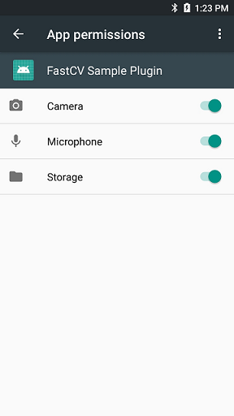

# FastCV plug-in Sample for RICOH THETA
This sample plug-in does image processing via FastCV.<br>
This project is based on [ricohapi/theta-plugin-camera-api-sample](https://github.com/ricohapi/theta-plugin-camera-api-sample).


## Sample Image
This is the output sample image captured by this plug-in.<br>


## Set up
* Download this project using git clone.

```
$ git clone https://github.com/ricohapi/theta-plugin-fastcv-sample
```

* Import this project by Android Studio.
* Build the plug-in and install to the THETA.
* Set up app permissions manually after the installation.<br>
Enable the permissions of "Camera", "Microphone" and "Storage".<br>


## Usage
* To run plug-in mode, press and hold the mode button.
* Press the mode button several times until the still mode lamp is turned.
* Press the shutter button and capture.
* The processed image is saved at "DCIM" directory.


## Development Environment
### Camera
* RICOH THETA V Firmware ver.2.50.1 and above

### SDK/Library
* RICOH THETA Plug-in SDK ver.1.0.1
* FastCV ver.1.7.1

### Development Software
* Android Studio ver.3.2+
* gradle ver.4.6
* NDK ver. 18.1.5063045


## License

```
Copyright 2018 Ricoh Company, Ltd.

Licensed under the Apache License, Version 2.0 (the "License");
you may not use this file except in compliance with the License.
You may obtain a copy of the License at

    http://www.apache.org/licenses/LICENSE-2.0

Unless required by applicable law or agreed to in writing, software
distributed under the License is distributed on an "AS IS" BASIS,
WITHOUT WARRANTIES OR CONDITIONS OF ANY KIND, either express or implied.
See the License for the specific language governing permissions and
limitations under the License.
```


